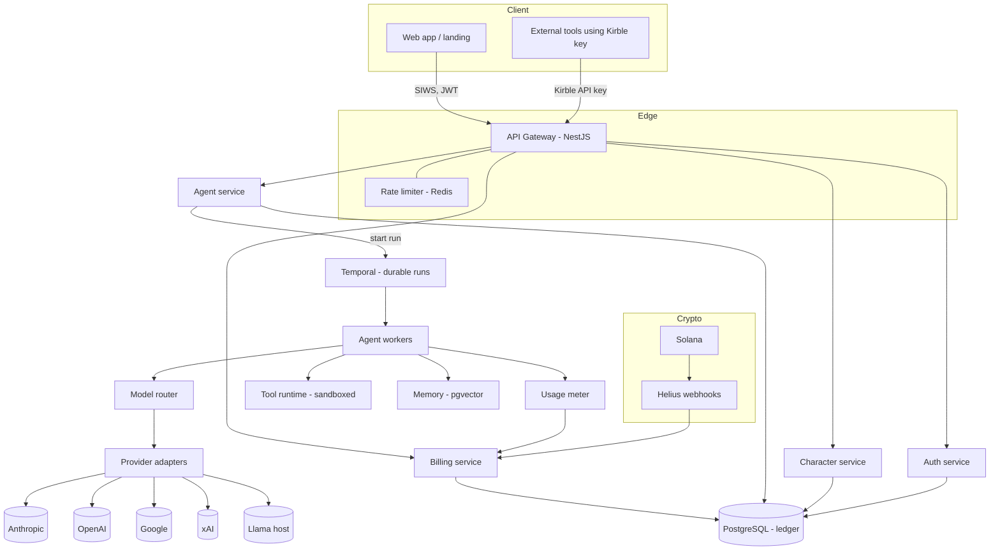
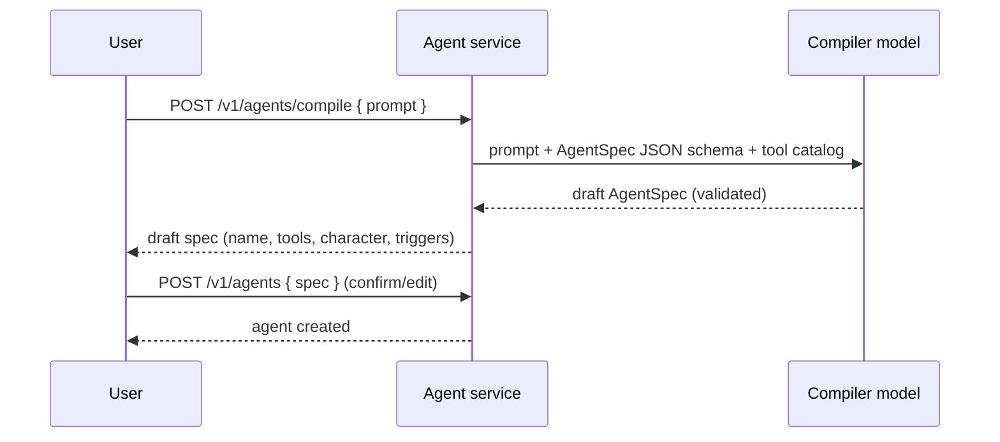
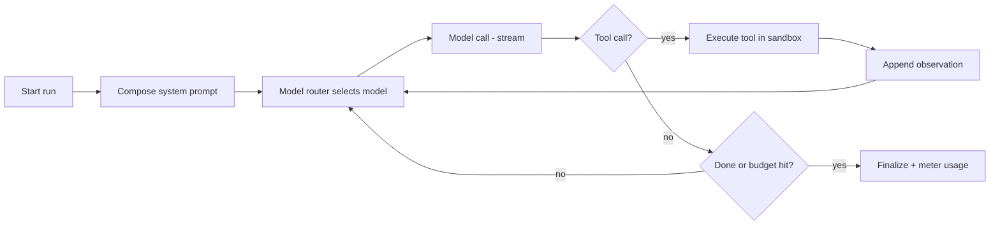
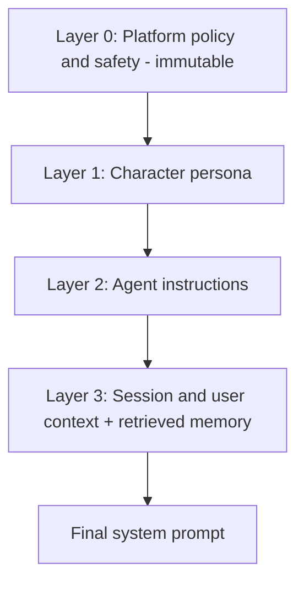

# Kirble Backend Developer Brief

**Version:** 1.0
**Audience:** Backend engineer(s) implementing the Kirble platform
**Status:** Ready for build
**Owner:** Ronald

---

## 1. Product context

Kirble lets anyone build a custom AI agent by describing it in plain language, giving it a **character** (persona), and launching it. Each agent is backed by multiple AI models (Claude, GPT, Gemini, Grok, Llama) behind a single Kirble API key. Users top up once with crypto (SOL or the `$KIRBLE` token) and spend across every model from one balance.

The frontend (landing page and app) is already designed. This brief specifies the **backend**: the services, data model, APIs, agent runtime, model router, character system, auth, and billing needed to make it real.

### 1.1 Core concepts (glossary)

| Term | Meaning |
|------|---------|
| **Agent** | A user created assistant with instructions, tools, a character, memory, and model preferences. |
| **Character** | A reusable persona (voice, values, style, guardrails) that shapes how an agent thinks and talks. |
| **Model** | A provider model (e.g. `claude-opus-4-8`, `gpt-5.6-terra`). Exposed through a normalized adapter. |
| **Run** | One execution of an agent (a conversation turn or a triggered background job). Durable and replayable. |
| **Thread** | A conversation context grouping messages and runs. |
| **Kirble key** | A single API key that unlocks every model, usable inside Kirble or in external tools. |
| **Ledger** | The double entry record of every credit (top up) and debit (usage) against a user balance. |

### 1.2 Goals

1. Turn a one sentence description into a working, runnable agent.
2. Route each task to the best model automatically, with graceful fallback.
3. Preserve an agent's character consistently across model switches.
4. Meter usage precisely and bill it against a crypto funded balance.
5. Expose one clean API and one key that work both inside Kirble and in external tools.

### 1.3 Non goals (v1)

Team accounts, custom fine tuning, a public character marketplace, and native mobile apps are **out of scope for v1**. Design the schema so they can be added later, but do not build them now.

---

## 2. Recommended tech stack

Chosen for developer velocity, first class streaming, mature provider SDKs, and a clean path to scale. Swap equivalents if your team is stronger elsewhere; the architecture does not depend on any single choice.

| Layer | Recommendation | Why |
|-------|----------------|-----|
| Language | **TypeScript on Node 20** | Best provider SDK coverage, native streaming, one language across API and agent runtime. |
| API framework | **NestJS** (Fastify adapter) | Modular structure, DI, guards/interceptors map cleanly to auth, rate limiting, billing. |
| Durable orchestration | **Temporal** | Agent runs are multi step and long lived. Temporal gives retries, timeouts, and replay for free. This is the backbone of a reliable agent runtime. |
| Primary database | **PostgreSQL 16** | Transactional integrity for the ledger, relational agent/character data. |
| ORM / query | **Drizzle ORM** | Type safe SQL, migrations, no heavy runtime. (Prisma is an acceptable alternative.) |
| Vector store | **pgvector** at start, **Qdrant** at scale | Keep memory in Postgres early; split out when embedding volume grows. |
| Cache / queues / rate limit | **Redis 7** | Sessions, token bucket rate limiting, hot config, lightweight queues. |
| Object storage | **S3 compatible** (R2 or S3) | File uploads, run artifacts, exported logs. |
| Model gateway | **Custom adapter layer** (LiteLLM optional behind it) | Normalize every provider to one interface; own the routing logic. |
| Crypto | **Solana web3.js + Helius** (RPC + webhooks) | Deposit detection, `$KIRBLE` SPL token, wallet auth. |
| Auth | **Sign In With Solana (SIWS)** to JWT | Wallet native login, no passwords. API keys for programmatic access. |
| Streaming transport | **SSE** for chat, **WebSocket** for the live app | SSE is simplest for token streams; WS where bidirectional is needed. |
| Observability | **OpenTelemetry + Grafana/Tempo/Prometheus + Sentry** | Trace every run, step, and model call end to end. |
| Deploy | **Docker + Kubernetes** (or Fly.io to start) | Stateless API pods, autoscaled workers. |

---

## 3. High level architecture



**Data flow, chat turn:**
1. Client opens an SSE stream to `POST /v1/chat/stream` with a Kirble key or JWT.
2. Gateway authenticates, checks rate limit, and confirms the user has a positive balance (or a reserved hold).
3. Agent service resolves the agent config + character, starts a Temporal run.
4. Worker composes the system prompt, asks the **model router** for a model, calls the provider adapter, and streams tokens back through the gateway.
5. Tool calls are executed in the sandbox, results fed back into the loop.
6. On completion, the **usage meter** writes a `usage_event`, and the billing service posts ledger debits.

---

## 4. Agent runtime and model routing (deep dive)

This is the heart of Kirble. It has four parts: the **spec compiler** (build an agent from a sentence), the **execution loop** (run it), the **model router** (pick the model), and the **provider adapters** (call it).

### 4.1 Agent spec compiler

When a user types "an agent that tracks crypto news and DMs me the alpha", Kirble compiles that into a structured, validated `AgentSpec`. Do this with a single strong model call constrained to a JSON schema, then show the result to the user for confirmation (human in the loop) before saving.



**AgentSpec (canonical config):**

```jsonc
{
  "name": "Crypto Alpha Scout",
  "description": "Tracks crypto news and surfaces high signal alpha.",
  "instructions": "Monitor sources X and Y. Summarize only market moving news...",
  "character_id": "char_analyst",          // persona, see section 5
  "model_policy": {
    "mode": "auto",                          // auto | pinned
    "pinned_model": null,                    // e.g. "claude-opus-4-8" when mode=pinned
    "cost_tier": "balanced",                 // economy | balanced | premium
    "max_latency_ms": 8000,
    "requires": ["function_calling"]         // capability hints
  },
  "tools": ["web_search", "http_fetch", "notify_user", "scheduler"],
  "memory": { "episodic": true, "semantic_profile": true, "window_strategy": "summarize" },
  "triggers": [
    { "type": "cron", "expr": "*/30 * * * *", "timezone": "Asia/Jakarta" },
    { "type": "chat" }
  ],
  "guardrails": { "max_steps": 12, "max_tokens_per_run": 60000, "budget_usd_per_run": 0.25 },
  "output": { "channels": ["chat", "dm"] }
}
```

The compiler must: pick tools only from the allowlisted catalog, never invent tool names, set safe default budgets, and default `character_id` to a sensible persona if the user did not choose one.

### 4.2 Execution loop (durable, Temporal workflow)

Each run is a Temporal workflow so it survives restarts, supports timeouts and retries, and is fully replayable for debugging. The loop is a bounded ReAct style controller.



Rules the loop must enforce:
- Stop at `max_steps`, `max_tokens_per_run`, or `budget_usd_per_run`, whichever comes first.
- Every step is a Temporal **activity** with its own retry policy and idempotency key.
- Persist each step to `run_steps` for replay and audit.
- Stream partial tokens to the client immediately; do not wait for the full turn.
- On provider failure mid stream, the router fails over (see 4.3) and the loop resumes from the last committed step.

### 4.3 Model router

The router turns a task plus the agent's `model_policy` and the character's model preference into a concrete model choice, with an ordered fallback chain.

**Inputs:** required capabilities (vision, long context, function calling), cost tier, latency SLA, character pin, current provider health, and live per provider price from `model_catalog`.

**Algorithm:**
1. **Filter** the catalog to models that satisfy hard requirements (capabilities, context length, availability).
2. **Score** each candidate: `score = w1*quality_rank + w2*(1/price) + w3*(1/expected_latency) + w4*health`. Weights derive from `cost_tier` (economy weights price, premium weights quality).
3. **Respect pins**: if the character or agent pins a model, that model is first, but a fallback chain is still built for resilience.
4. **Fallback chain**: return an ordered list. On error, rate limit, or timeout, advance to the next. Use a **circuit breaker** per provider (open after N consecutive failures, half open probe after cooldown).
5. **Character preservation**: when falling over to a different provider, re inject the full character system prompt so voice stays consistent (see section 5.4).

```typescript
interface RoutingRequest {
  requires: Capability[];
  costTier: 'economy' | 'balanced' | 'premium';
  maxLatencyMs?: number;
  pinnedModel?: string;
  estTokens: { input: number; output: number };
}

interface RoutingDecision {
  primary: ModelRef;
  fallbacks: ModelRef[];       // ordered
  reason: string;              // for observability
  estCostUsd: number;
}

interface ModelRouter {
  route(req: RoutingRequest, ctx: RunContext): Promise<RoutingDecision>;
}
```

### 4.4 Provider adapters

One normalized interface for every provider. Adapters translate to and from provider specifics and **normalize token usage, errors, and streaming**.

```typescript
interface ProviderAdapter {
  readonly provider: 'anthropic' | 'openai' | 'google' | 'xai' | 'llama';

  chat(req: NormalizedChatRequest): Promise<NormalizedChatResponse>;
  stream(req: NormalizedChatRequest): AsyncIterable<ChatChunk>;   // token deltas + tool calls
  embed(req: EmbedRequest): Promise<EmbedResponse>;

  // normalization helpers
  countTokens(messages: Message[]): number;
  mapError(providerError: unknown): NormalizedError;             // -> retryable? rate limited?
}

interface Usage {
  inputTokens: number;
  outputTokens: number;
  cacheReadTokens: number;      // priced far cheaper, see billing
  cacheWriteTokens: number;
}
```

Adapter responsibilities:
- **Unified tool/function calling**: translate the internal tool schema to each provider's format and normalize tool call outputs back.
- **Retry with jittered backoff** on 429/5xx, capped; surface `retryable` to the router.
- **Rate limit accounting**: track per provider concurrency and TPM/RPM with a Redis token bucket so you never exceed provider quotas.
- **Prompt caching**: when a provider supports it, mark the stable prefix (platform + character prompt) as cacheable to cut cost.

### 4.5 Tool runtime

Tools are how agents act. Keep them **sandboxed, allowlisted per agent, and secret safe**.

- **Registry**: each tool has a name, JSON Schema for args, a handler, a scope, and a cost/permission flag.
- **Execution**: run tool handlers in an isolated worker (separate process or Firecracker/gVisor for untrusted code tools). Enforce timeouts and network egress allowlists.
- **Secrets**: tools never see the user's raw keys. Inject credentials from a vault (KMS backed) at call time, scoped to the agent.
- **Built in tools (v1)**: `web_search`, `http_fetch`, `code_exec` (sandboxed), `memory_read` / `memory_write`, `scheduler`, `notify_user` (chat/DM), `wallet_balance` (read only).

```jsonc
{
  "name": "http_fetch",
  "description": "Fetch a URL and return text content.",
  "args_schema": { "type": "object", "properties": { "url": { "type": "string", "format": "uri" } }, "required": ["url"] },
  "scope": "network:egress",
  "timeout_ms": 10000,
  "billable": false
}
```

### 4.6 Memory

Three tiers:
1. **Working memory**: the live context window. When it approaches the model limit, summarize older turns (map reduce summary) and keep a rolling buffer. Strategy set per agent (`window_strategy`).
2. **Episodic memory**: embed messages and tool observations into `memory_chunks` (pgvector). Retrieve top k by cosine similarity at the start of each run.
3. **Semantic profile**: a compact, updated summary of durable facts about the user and the agent's domain, injected every run.

Retrieval pipeline: embed the current query, ANN search scoped to `(agent_id, thread_id)`, re rank, and inject as context with clear provenance so the model can cite it.

---

## 5. Character system (deep dive)

A character is a reusable persona. It changes **how** an agent communicates without changing **what** it does. Characters must stay consistent even when the underlying model changes.

### 5.1 Character schema

```jsonc
{
  "id": "char_analyst",
  "name": "The Analyst",
  "tagline": "Precise, data first, no fluff.",
  "identity": "A rigorous market analyst who values evidence over hype.",
  "voice": {
    "tone": ["precise", "direct", "calm"],
    "formality": 0.6,             // 0 casual .. 1 formal
    "verbosity": 0.3,             // terse .. expansive
    "emoji": false,
    "signature_moves": ["leads with the number", "flags uncertainty explicitly"]
  },
  "values": ["accuracy", "transparency"],
  "dos": ["cite sources", "quantify claims"],
  "donts": ["never hype", "never give financial advice as a certainty"],
  "sample_utterances": ["Here is what the data actually says."],
  "model_affinity": { "preferred": "claude-opus-4-8", "temperature": 0.4 },
  "safety_locked": true            // platform safety always overrides persona
}
```

### 5.2 Persona to system prompt composition

The final system prompt is assembled from **layered templates** with strict precedence. Higher layers cannot be overridden by lower ones.



- **Layer 0 (platform)**: safety rules, refusal policy, tool use policy. Always present, never editable by users or characters.
- **Layer 1 (character)**: identity, voice, dos/donts rendered from the schema into natural language.
- **Layer 2 (agent)**: the agent's task instructions from `AgentSpec.instructions`.
- **Layer 3 (session)**: retrieved memory, user profile, current time/timezone, channel.

Store templates as versioned, testable strings. Render deterministically so the same inputs always produce the same prompt (important for prompt caching and evals).

### 5.3 Voice knobs to prompt

Map the numeric `voice` knobs to concrete instructions and to model sampling params. Example: `verbosity: 0.3` becomes "Keep answers short, usually two to four sentences" and sets a lower `max_tokens` soft target; `temperature` comes from `model_affinity`. Keep this mapping in one module so behavior is consistent.

### 5.4 Character preservation across models (critical)

Because Kirble routes across providers, the same character must feel identical on Claude, GPT, or Gemini. Enforce this by:
1. Re rendering the **full** Layer 0 to Layer 3 prompt for every model call, never relying on provider side state.
2. Normalizing sampling: translate the character's intended `temperature`/`top_p` to each provider's equivalent range.
3. Running a **character consistency eval** in CI: a fixed set of prompts run against each model, scored for tone adherence. Fail the build if a model drifts beyond threshold.

### 5.5 Character lifecycle

Characters are versioned (`character_versions`). Editing creates a new version; running agents pin a version for stability and can opt into upgrades. Moderation status is tracked so user created characters can be reviewed before they are shared (post v1).

---

## 6. API design (deep dive)

**Base:** `https://api.kirble.xyz/v1`
**Conventions:** JSON, cursor pagination, `Idempotency-Key` on all writes, RFC 9457 `application/problem+json` errors, semantic versioning in the path (`/v1`).

### 6.1 Authentication

Two mechanisms:

1. **Sign In With Solana (SIWS)** for the web app, producing a short lived access JWT and a refresh token.
2. **Kirble API key** for programmatic use and external tools ("one key, every model"). Keys are scoped and rate limited per plan.

```
POST /v1/auth/nonce        { wallet } -> { nonce, expiresAt }
POST /v1/auth/verify       { wallet, signature } -> { accessToken, refreshToken }
POST /v1/auth/refresh      { refreshToken } -> { accessToken }
POST /v1/keys              { name, scopes[] } -> { keyId, plaintextKey }   // shown once
GET  /v1/keys              -> [ { keyId, name, scopes, lastUsedAt, prefix } ]
DELETE /v1/keys/:keyId
```

**Key format:** `kf_live_<base62>`; store only a hash (SHA 256) plus a short lookup `prefix`. Never log the plaintext. Support scopes such as `chat:write`, `agents:manage`, `billing:read`.

### 6.2 Core resources

```
# Agents
POST   /v1/agents/compile        { prompt } -> draft AgentSpec
POST   /v1/agents                { spec }   -> Agent
GET    /v1/agents                -> [Agent]
GET    /v1/agents/:id
PATCH  /v1/agents/:id            { spec patch }
DELETE /v1/agents/:id
POST   /v1/agents/:id/publish    -> pins a new agent_version

# Characters
GET    /v1/characters            -> [Character]   (built in + user owned)
POST   /v1/characters            { character }
GET    /v1/characters/:id
PATCH  /v1/characters/:id
POST   /v1/characters/preview    { character, prompt } -> sample reply (for the picker UI)

# Chat / runs
POST   /v1/threads               -> Thread
POST   /v1/chat                  { threadId, agentId, message } -> Run (non streaming)
POST   /v1/chat/stream           { threadId, agentId, message } -> SSE token stream
GET    /v1/runs/:id              -> Run (status, steps, usage)
POST   /v1/runs/:id/cancel

# Models
GET    /v1/models                -> normalized catalog (id, provider, price, capabilities)

# Billing
GET    /v1/billing/wallet        -> { balanceUsd, kirbleBalance, address }
POST   /v1/billing/topup/intent  { asset: "SOL"|"KIRBLE", amount } -> { depositAddress, memo, expiresAt }
GET    /v1/billing/usage         ?from&to -> aggregated usage + cost
GET    /v1/billing/ledger        -> paginated ledger entries
```

### 6.3 Streaming contract (SSE)

```
POST /v1/chat/stream
Accept: text/event-stream

event: run.started     data: { "runId": "...", "model": "claude-opus-4-8" }
event: token           data: { "delta": "Here is " }
event: tool.call       data: { "tool": "web_search", "args": { ... } }
event: tool.result     data: { "tool": "web_search", "ok": true }
event: model.switched  data: { "from": "gpt-5.6-terra", "to": "claude-sonnet-5", "reason": "provider_timeout" }
event: usage           data: { "inputTokens": 812, "outputTokens": 240, "costUsd": 0.0016 }
event: run.completed   data: { "runId": "...", "finishReason": "stop" }
event: error           data: { "type": "insufficient_balance", "detail": "..." }
```

### 6.4 Cross cutting rules

- **Rate limiting**: Redis token bucket keyed by `api_key_id` (or `user_id` for JWT), tiered by plan. Return `429` with `Retry-After`.
- **Idempotency**: writes require `Idempotency-Key`; store the first response for 24h and replay it on retry.
- **Balance guard**: before starting a run, place a **hold** (reservation) for the estimated cost; settle the real cost on completion and release the remainder.
- **Errors**: consistent `problem+json` with a stable `type` URI, `title`, `status`, `detail`, `instance`.
- **Versioning**: additive changes only within `/v1`; breaking changes go to `/v2`.

---

## 7. Data model and schema (deep dive)

PostgreSQL is the source of truth. Enable `pgcrypto` (UUIDs) and `vector` (pgvector). Use **Row Level Security** so every tenant only sees their own rows. All money is stored as integer **micro USD** (`bigint`, 1 USD = 1,000,000) to avoid float drift.

### 7.1 Core tables (DDL sketch)

```sql
create table users (
  id            uuid primary key default gen_random_uuid(),
  wallet        text unique not null,           -- Solana base58 pubkey
  handle        text,
  created_at    timestamptz not null default now()
);

create table api_keys (
  id            uuid primary key default gen_random_uuid(),
  user_id       uuid not null references users(id) on delete cascade,
  name          text not null,
  prefix        text not null,                  -- fast lookup, e.g. "kf_live_ab12"
  key_hash      bytea not null,                 -- sha256 of full key
  scopes        text[] not null default '{}',
  last_used_at  timestamptz,
  revoked_at    timestamptz,
  created_at    timestamptz not null default now()
);
create index on api_keys (prefix);

create table characters (
  id            uuid primary key default gen_random_uuid(),
  owner_id      uuid references users(id) on delete cascade,   -- null = built in
  name          text not null,
  is_builtin    boolean not null default false,
  latest_version int not null default 1,
  moderation    text not null default 'approved',              -- pending|approved|rejected
  created_at    timestamptz not null default now()
);

create table character_versions (
  id            uuid primary key default gen_random_uuid(),
  character_id  uuid not null references characters(id) on delete cascade,
  version       int not null,
  config        jsonb not null,                 -- the Character schema (section 5.1)
  created_at    timestamptz not null default now(),
  unique (character_id, version)
);

create table agents (
  id            uuid primary key default gen_random_uuid(),
  owner_id      uuid not null references users(id) on delete cascade,
  name          text not null,
  latest_version int not null default 1,
  status        text not null default 'active', -- active|paused|archived
  created_at    timestamptz not null default now()
);

create table agent_versions (
  id            uuid primary key default gen_random_uuid(),
  agent_id      uuid not null references agents(id) on delete cascade,
  version       int not null,
  spec          jsonb not null,                 -- the AgentSpec (section 4.1)
  character_version_id uuid references character_versions(id),
  created_at    timestamptz not null default now(),
  unique (agent_id, version)
);

create table threads (
  id            uuid primary key default gen_random_uuid(),
  owner_id      uuid not null references users(id) on delete cascade,
  agent_id      uuid references agents(id) on delete set null,
  title         text,
  created_at    timestamptz not null default now()
);

create table messages (
  id            uuid primary key default gen_random_uuid(),
  thread_id     uuid not null references threads(id) on delete cascade,
  role          text not null,                  -- user|assistant|tool|system
  content       jsonb not null,
  run_id        uuid,
  created_at    timestamptz not null default now()
);
create index on messages (thread_id, created_at);

create table runs (
  id            uuid primary key default gen_random_uuid(),
  agent_version_id uuid not null references agent_versions(id),
  thread_id     uuid references threads(id) on delete set null,
  owner_id      uuid not null references users(id),
  status        text not null default 'running',-- running|completed|failed|cancelled
  trigger       text not null default 'chat',   -- chat|cron|webhook|event
  hold_micro_usd bigint not null default 0,     -- reserved at start
  cost_micro_usd bigint not null default 0,     -- settled at end
  started_at    timestamptz not null default now(),
  finished_at   timestamptz
);

create table run_steps (
  id            uuid primary key default gen_random_uuid(),
  run_id        uuid not null references runs(id) on delete cascade,
  idx           int not null,
  kind          text not null,                  -- model_call|tool_call|summary
  model         text,                           -- resolved model id if model_call
  input         jsonb,
  output        jsonb,
  usage         jsonb,                           -- normalized Usage
  latency_ms    int,
  created_at    timestamptz not null default now(),
  unique (run_id, idx)
);

create table memory_chunks (
  id            uuid primary key default gen_random_uuid(),
  owner_id      uuid not null references users(id) on delete cascade,
  agent_id      uuid references agents(id) on delete cascade,
  thread_id     uuid references threads(id) on delete cascade,
  content       text not null,
  embedding     vector(1536) not null,
  created_at    timestamptz not null default now()
);
create index on memory_chunks using ivfflat (embedding vector_cosine_ops);

create table model_catalog (
  id            text primary key,               -- "claude-opus-4-8"
  provider      text not null,
  display_name  text not null,
  in_price_micro_usd   bigint not null,         -- per 1M input tokens
  out_price_micro_usd  bigint not null,
  cache_price_micro_usd bigint,
  context_tokens int not null,
  capabilities  text[] not null default '{}',   -- function_calling, vision, long_context
  quality_rank  int not null default 100,
  enabled       boolean not null default true
);
```

### 7.2 Billing tables

```sql
create table wallets (
  user_id       uuid primary key references users(id) on delete cascade,
  balance_micro_usd bigint not null default 0,
  kirble_balance bigint not null default 0,      -- token base units
  updated_at    timestamptz not null default now()
);

-- Double entry ledger: every credit and debit is one row, immutable.
create table ledger_entries (
  id            uuid primary key default gen_random_uuid(),
  user_id       uuid not null references users(id),
  kind          text not null,                   -- topup|usage|hold|hold_release|refund|adjustment
  amount_micro_usd bigint not null,              -- signed: +credit / -debit
  ref_type      text,                            -- run|deposit
  ref_id        uuid,
  metadata      jsonb,
  created_at    timestamptz not null default now()
);
create index on ledger_entries (user_id, created_at);

create table deposits (
  id            uuid primary key default gen_random_uuid(),
  user_id       uuid not null references users(id),
  asset         text not null,                   -- SOL|KIRBLE
  tx_signature  text unique not null,            -- on chain, idempotency anchor
  amount_native bigint not null,                 -- lamports or token base units
  credited_micro_usd bigint not null,            -- after oracle conversion
  status        text not null default 'pending', -- pending|confirmed|credited
  created_at    timestamptz not null default now()
);

create table usage_events (
  id            uuid primary key default gen_random_uuid(),
  user_id       uuid not null references users(id),
  run_id        uuid references runs(id),
  model         text not null,
  input_tokens  bigint not null,
  output_tokens bigint not null,
  cache_tokens  bigint not null default 0,
  cost_micro_usd bigint not null,
  created_at    timestamptz not null default now()
);
create index on usage_events (user_id, created_at);
```

### 7.3 Redis keyspace

- `rl:{keyId}` token bucket for rate limiting.
- `sess:{jwtId}` session/refresh metadata.
- `cfg:models` cached `model_catalog` (refreshed on change).
- `hold:{runId}` in flight cost reservation for fast checks.
- `nonce:{wallet}` SIWS login nonce with TTL.

---

## 8. Crypto billing (moderate depth)

Balance is denominated in micro USD credits. Crypto is the **funding rail**, not the accounting unit, which keeps pricing stable while models are billed in USD.

**Top up flow:**
1. `POST /v1/billing/topup/intent` returns a deposit address (or program instruction) and a `memo` that ties the deposit to the user.
2. User sends SOL or `$KIRBLE`.
3. **Helius webhook** notifies the backend of the transfer. Verify on chain confirmation depth.
4. Convert native amount to micro USD via a price oracle (e.g. Pyth for SOL; internal or DEX TWAP for `$KIRBLE`). Apply the `$KIRBLE` discount tier (paying in the token unlocks better rates).
5. Insert a `deposits` row keyed by `tx_signature` (idempotent), then a `ledger_entries` credit, then bump `wallets.balance_micro_usd` in one transaction.

**Metering and holds:**
- At run start, estimate cost and write a `hold` ledger entry plus a Redis `hold:{runId}`. Reject if balance minus holds is negative.
- Per model call, the meter computes `cost = input_tokens*in_price + output_tokens*out_price + cache_tokens*cache_price` (all per 1M, from `model_catalog`).
- At run end, release the hold and post the real `usage` debit. Everything is one DB transaction so the ledger never drifts.

**Idempotency and fraud:** deposits are deduped on `tx_signature`; never credit twice. Watch for chain reorgs by waiting for finality before crediting. Log every conversion with the oracle price used.

---

## 9. Security

- **Auth**: SIWS nonce is single use with short TTL; verify the signature against the claimed wallet. JWT access tokens are short lived; refresh rotation with reuse detection.
- **API keys**: stored hashed, shown once, scoped, revocable, rate limited. Prefix based lookup, constant time compare.
- **Tenant isolation**: Postgres RLS on every user owned table; the app sets `SET app.user_id` per request.
- **Secrets**: provider keys and tool credentials live in a KMS backed vault, never in the DB in plaintext, injected at call time.
- **Tool sandbox**: untrusted tool/code execution runs in isolated microVMs with egress allowlists and hard timeouts.
- **Prompt injection defenses**: treat tool and web content as untrusted; keep the Layer 0 policy immutable and outside model editable context; strip and escape tool output; never let retrieved content change tool permissions.
- **Abuse and cost control**: per user and per key budgets, anomaly detection on spend, hard kill switch per agent.
- **Audit**: append only audit log for auth events, key lifecycle, billing, and agent publishes.

---

## 10. Observability and quality

- **Tracing**: one OpenTelemetry trace per run; spans for each step, model call, and tool call, tagged with model, tokens, cost, and latency. This makes "why was this slow or expensive" answerable in one view.
- **Metrics**: per provider error rate, latency p50/p95, tokens/sec, fallback rate, cost per run, balance holds outstanding.
- **Logs**: structured (pino), correlated by `runId` and `traceId`; never log secrets or full prompts by default (sample with redaction).
- **Evals**: a CI eval harness for (a) agent task success on golden cases and (b) character consistency across models (section 5.4). Gate deploys on these.
- **Replay**: because runs are Temporal workflows plus `run_steps`, any run can be replayed deterministically for debugging.

---

## 11. Scalability and infrastructure

- **Stateless API pods** behind a load balancer; scale on CPU and request latency.
- **Agent workers** scale on Temporal task queue depth; isolate heavy/long runs from interactive chat on separate queues.
- **Provider concurrency**: a global Redis token bucket per provider prevents quota breaches across all workers.
- **Caching**: prompt caching at the provider for the stable prompt prefix; embedding cache; `model_catalog` in Redis.
- **DB**: primary plus read replicas; the ledger writes stay on the primary in transactions. Partition `usage_events` and `ledger_entries` by month.
- **Multi region later**: keep the design region agnostic; the only hard state is Postgres and Redis.

---

## 12. Suggested build order (milestones)

| Milestone | Scope | Outcome |
|-----------|-------|---------|
| **M0 Foundations** | Repo, CI, Postgres + Redis, auth (SIWS + keys), model catalog, one provider adapter | You can log in with a wallet and call one model through Kirble. |
| **M1 Chat + router** | Provider adapters for all 5, model router with fallback, SSE streaming, threads/messages | Real multi model chat with automatic routing. |
| **M2 Characters** | Character schema, prompt composition, picker preview endpoint, consistency eval | Agents have consistent personas across models. |
| **M3 Agents runtime** | Spec compiler, Temporal runs, tools, memory, triggers | Users build and run real agents from a sentence. |
| **M4 Billing** | Wallet, deposits via Helius, holds + metering + ledger, `$KIRBLE` discount | Usage is metered and paid from a crypto balance. |
| **M5 Hardening** | Rate limits, RLS, audit, observability dashboards, load tests | Production ready. |

---

## 13. Open questions for Ronald

1. **Llama hosting**: self host (vLLM) or a hosted inference provider? Affects the adapter and cost model.
2. **`$KIRBLE` price source**: which oracle/DEX pair is canonical for the token to USD conversion?
3. **Discount tiers**: exact `$KIRBLE` discount curve (flat percentage, or tiered by holdings)?
4. **Agent triggers in v1**: ship cron + chat only, or also inbound webhooks at launch?
5. **External tool delivery** (DMs, notifications): which channels at launch (in app only, or X/Telegram)?
6. **Data retention**: how long do we keep prompts, memory, and run logs, and what is user deletable?

---

*Prepared for the Kirble backend build. Pair this with the existing frontend (`index.html`). Sections 4, 5, and 6/7 are the priority per product focus.*
