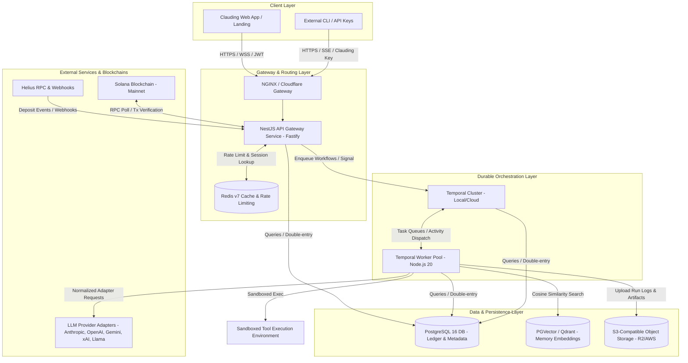
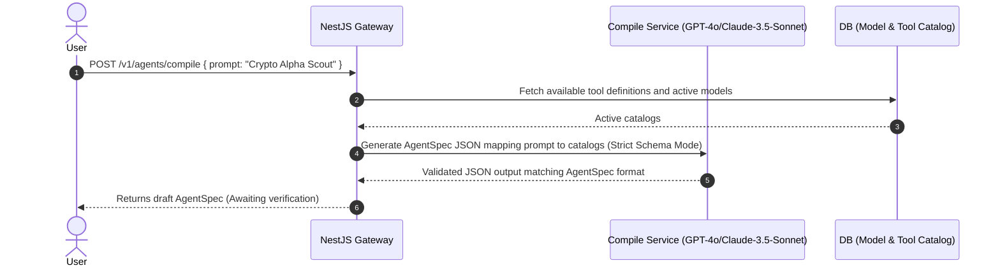
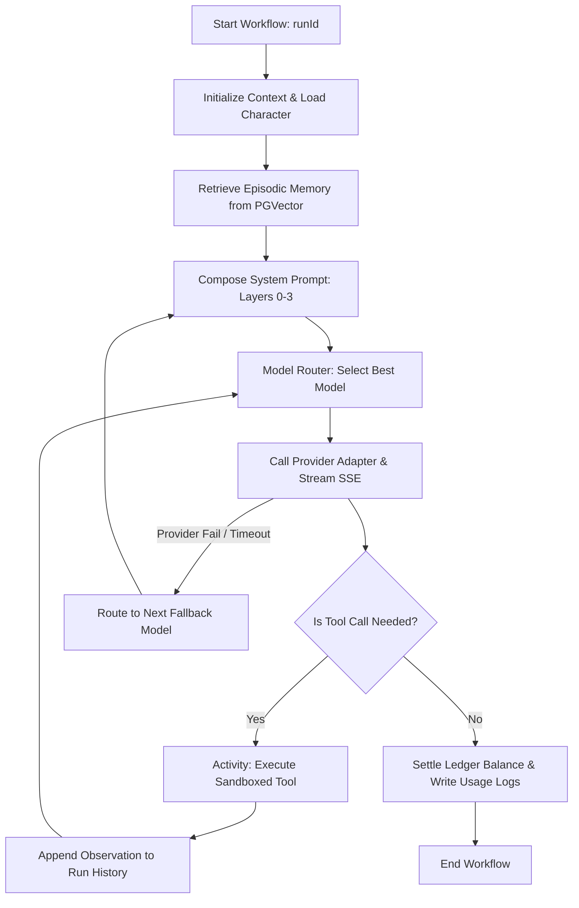
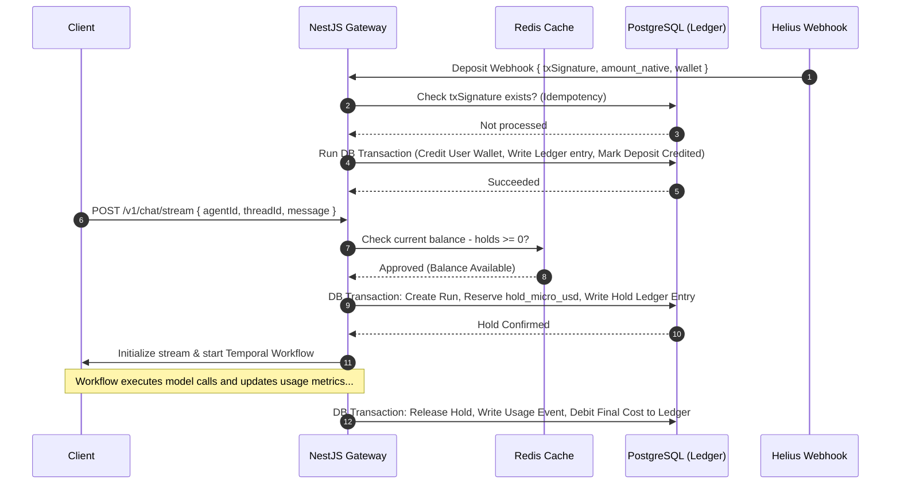

# Clauding Backend — Complete Execution Guide & System Architecture
**Version:** 1.0 (Production Blueprint)  
**Author:** Senior Backend Architect (20+ Years Experience)  
**Target Audience:** Backend Engineers, DevOps, and Lead Architects  

---

## 1. System Topology & Infrastructure Layout

The Clauding backend is designed as a highly scalable, event-driven, and durable service mesh. It decouples the low-latency API Gateway from the long-lived, high-latency Agent Execution runs using **Temporal Orchestration**.



---

## 2. Core Feature Pipelines & Execution Specifications

### 2.1 Agent Spec Compilation (`POST /v1/agents/compile`)
Converts natural language descriptions into a deterministic `AgentSpec` schema.



**Step-by-Step Backend Pipeline:**
1. **Sanitize Prompt:** Filter malicious injections or system overrides from the user prompt.
2. **Context Enrichment:** Read allowed tool catalogs and baseline models from the PostgreSQL database.
3. **Structured Generation:** Call the compiler LLM with a system prompt specifying the JSON Schema constraints using `response_format: { type: "json_object" }` or Anthropic tool use.
4. **Validation:** Use `class-validator` / `zod` schema on the generated JSON to verify compliance.
5. **Caching:** Cache the draft layout in Redis with a 15-minute TTL to facilitate quick confirmation edits.

---

### 2.2 Durable Agent Execution Loop (Temporal Workflow)
Enforces reliability and recovery for multi-step agent actions.



---

### 2.3 Double-Entry Crypto Billing & Settle Flow
Prevents race conditions, double spending, and credit balance drifts using database transactions.



---

## 3. Database Schema & Migration Script

This PostgreSQL 16 DDL establishes the core schema, incorporating `pgvector`, row-level security (RLS), micro-USD transaction safety, and double-entry ledgers.

```sql
-- Enable necessary extensions
create extension if not exists "uuid-ossp";
create extension if not exists "pgcrypto";
create extension if not exists "vector";

-- ==========================================
-- 1. TENANCY & USERS
-- ==========================================
create table users (
  id            uuid primary key default gen_random_uuid(),
  wallet        text unique not null,           -- Solana Base58 public key
  handle        text,
  created_at    timestamptz not null default now()
);

-- ==========================================
-- 2. AUTHENTICATION & API KEYS
-- ==========================================
create table api_keys (
  id            uuid primary key default gen_random_uuid(),
  user_id       uuid not null references users(id) on delete cascade,
  name          text not null,
  prefix        text not null,                  -- e.g. "kf_live_ab12"
  key_hash      bytea not null,                 -- SHA256 of full key
  scopes        text[] not null default '{}',
  last_used_at  timestamptz,
  revoked_at    timestamptz,
  created_at    timestamptz not null default now()
);
create index idx_api_keys_prefix on api_keys(prefix);

-- ==========================================
-- 3. CHARACTERS & VERSIONS
-- ==========================================
create table characters (
  id            uuid primary key default gen_random_uuid(),
  owner_id      uuid references users(id) on delete cascade,   -- NULL for global built-ins
  name          text not null,
  is_builtin    boolean not null default false,
  latest_version int not null default 1,
  moderation    text not null default 'approved',              -- pending | approved | rejected
  created_at    timestamptz not null default now()
);

create table character_versions (
  id            uuid primary key default gen_random_uuid(),
  character_id  uuid not null references characters(id) on delete cascade,
  version       int not null,
  config        jsonb not null,                 -- Reusable persona JSON schema (Tone, Voice, Knobs)
  created_at    timestamptz not null default now(),
  unique (character_id, version)
);

-- ==========================================
-- 4. AGENTS & VERSIONS
-- ==========================================
create table agents (
  id            uuid primary key default gen_random_uuid(),
  owner_id      uuid not null references users(id) on delete cascade,
  name          text not null,
  latest_version int not null default 1,
  status        text not null default 'active', -- active | paused | archived
  created_at    timestamptz not null default now()
);

create table agent_versions (
  id            uuid primary key default gen_random_uuid(),
  agent_id      uuid not null references agents(id) on delete cascade,
  version       int not null,
  spec          jsonb not null,                 -- Complete AgentSpec configuration
  character_version_id uuid references character_versions(id),
  created_at    timestamptz not null default now(),
  unique (agent_id, version)
);

-- ==========================================
-- 5. CHAT & RUN SESSION HISTORY
-- ==========================================
create table threads (
  id            uuid primary key default gen_random_uuid(),
  owner_id      uuid not null references users(id) on delete cascade,
  agent_id      uuid references agents(id) on delete set null,
  title         text,
  created_at    timestamptz not null default now()
);

create table runs (
  id            uuid primary key default gen_random_uuid(),
  agent_version_id uuid not null references agent_versions(id),
  thread_id     uuid references threads(id) on delete set null,
  owner_id      uuid not null references users(id),
  status        text not null default 'running',-- running | completed | failed | cancelled
  trigger       text not null default 'chat',   -- chat | cron | webhook
  hold_micro_usd bigint not null default 0,     -- Reserved credit hold
  cost_micro_usd bigint not null default 0,     -- Final settled transaction cost
  started_at    timestamptz not null default now(),
  finished_at   timestamptz
);

create table messages (
  id            uuid primary key default gen_random_uuid(),
  thread_id     uuid not null references threads(id) on delete cascade,
  role          text not null,                  -- user | assistant | tool | system
  content       jsonb not null,                 -- Support rich text, markdown, or tool payloads
  run_id        uuid references runs(id) on delete set null,
  created_at    timestamptz not null default now()
);
create index idx_messages_thread_created on messages(thread_id, created_at);

create table run_steps (
  id            uuid primary key default gen_random_uuid(),
  run_id        uuid not null references runs(id) on delete cascade,
  idx           int not null,                   -- Order of execution steps within the run
  kind          text not null,                  -- model_call | tool_call | summary
  model         text,                           -- LLM ID used for this step
  input         jsonb,                          -- Input prompt, payload
  output        jsonb,                          -- Raw response
  usage         jsonb,                          -- Token consumption breakdown
  latency_ms    int,
  created_at    timestamptz not null default now(),
  unique (run_id, idx)
);

-- ==========================================
-- 6. LONG-TERM MEMORY (Vector Search)
-- ==========================================
create table memory_chunks (
  id            uuid primary key default gen_random_uuid(),
  owner_id      uuid not null references users(id) on delete cascade,
  agent_id      uuid references agents(id) on delete cascade,
  thread_id     uuid references threads(id) on delete cascade,
  content       text not null,
  embedding     vector(1536) not null,         -- Optimized for OpenAI or local embeddings
  created_at    timestamptz not null default now()
);
create index idx_memory_chunks_vector on memory_chunks using ivfflat (embedding vector_cosine_ops);

-- ==========================================
-- 7. BILLING, LEDGERS & WALLETS
-- ==========================================
create table wallets (
  user_id       uuid primary key references users(id) on delete cascade,
  balance_micro_usd bigint not null default 0,  -- Denominated in USD (1 USD = 1,000,000 micro-USD)
  clauding_balance bigint not null default 0,      -- Deposited SPL token balance
  updated_at    timestamptz not null default now()
);

create table ledger_entries (
  id            uuid primary key default gen_random_uuid(),
  user_id       uuid not null references users(id),
  kind          text not null,                   -- topup | usage | hold | hold_release | refund
  amount_micro_usd bigint not null,              -- Signed: positive (+) for credits, negative (-) for debits
  ref_type      text,                            -- 'run' | 'deposit'
  ref_id        uuid,
  metadata      jsonb,
  created_at    timestamptz not null default now()
);
create index idx_ledger_user_created on ledger_entries(user_id, created_at);

create table deposits (
  id            uuid primary key default gen_random_uuid(),
  user_id       uuid not null references users(id),
  asset         text not null,                   -- SOL | CLAUDING
  tx_signature  text unique not null,            -- Solana transaction hash for deduplication
  amount_native bigint not null,                 -- Lamports / Token atomic units
  credited_micro_usd bigint not null,            -- Final credited amount in micro USD
  status        text not null default 'pending', -- pending | confirmed | credited
  created_at    timestamptz not null default now()
);

create table usage_events (
  id            uuid primary key default gen_random_uuid(),
  user_id       uuid not null references users(id),
  run_id        uuid references runs(id) on delete set null,
  model         text not null,
  input_tokens  bigint not null,
  output_tokens bigint not null,
  cache_tokens  bigint not null default 0,
  cost_micro_usd bigint not null,
  created_at    timestamptz not null default now()
);
create index idx_usage_user_created on usage_events(user_id, created_at);

create table model_catalog (
  id            text primary key,               -- Unique model ID (e.g. "claude-3-5-sonnet")
  provider      text not null,                  -- anthropic | openai | google | xai | llama
  display_name  text not null,
  in_price_micro_usd   bigint not null,         -- Cost per 1M input tokens
  out_price_micro_usd  bigint not null,         -- Cost per 1M output tokens
  cache_price_micro_usd bigint,                 -- Cost per 1M cached tokens
  context_tokens int not null,
  capabilities  text[] not null default '{}',   -- function_calling, vision, long_context
  quality_rank  int not null default 100,       -- Priority score for auto routing (0-100)
  enabled       boolean not null default true
);

-- ==========================================
-- 8. ROW LEVEL SECURITY (RLS)
-- ==========================================
alter table users enable row level security;
alter table api_keys enable row level security;
alter table agents enable row level security;
alter table threads enable row level security;
alter table messages enable row level security;
alter table runs enable row level security;
alter table wallets enable row level security;
alter table ledger_entries enable row level security;

-- Example User RLS Policy
create policy user_isolation_policy on users
  for all using (id = nullif(current_setting('app.user_id', true), '')::uuid);
create policy apikey_isolation_policy on api_keys
  for all using (user_id = nullif(current_setting('app.user_id', true), '')::uuid);
create policy agents_isolation_policy on agents
  for all using (owner_id = nullif(current_setting('app.user_id', true), '')::uuid);
create policy wallets_isolation_policy on wallets
  for all using (user_id = nullif(current_setting('app.user_id', true), '')::uuid);
create policy ledger_isolation_policy on ledger_entries
  for all using (user_id = nullif(current_setting('app.user_id', true), '')::uuid);
```

---

## 4. Key Component Implementation Skeletons

### 4.1 The Model Router Logic (`model-router.service.ts`)
Calculates candidate quality vs. cost scores and manages automatic model switching.

```typescript
import { Injectable } from '@nestjs/common';

export interface RoutingRequest {
  requires: string[];
  costTier: 'economy' | 'balanced' | 'premium';
  maxLatencyMs?: number;
  pinnedModel?: string;
  estTokens: { input: number; output: number };
}

export interface ModelRef {
  id: string;
  provider: string;
  inPriceMicroUsd: number;
  outPriceMicroUsd: number;
  qualityRank: number;
  latencyAvgMs: number;
  healthy: boolean;
}

@Injectable()
export class ModelRouter {
  private weights = {
    economy:  { quality: 0.1, cost: 0.8, latency: 0.1 },
    balanced: { quality: 0.4, cost: 0.4, latency: 0.2 },
    premium:  { quality: 0.8, cost: 0.1, latency: 0.1 }
  };

  public route(req: RoutingRequest, models: ModelRef[]): ModelRef[] {
    // 1. Filter out incapable or unhealthy models
    const candidates = models.filter(m => {
      if (!m.healthy) return false;
      if (req.pinnedModel && m.id !== req.pinnedModel) return false;
      return true;
    });

    if (candidates.length === 0) {
      throw new Error("No healthy candidate models found matching requirements");
    }

    // 2. Score candidates based on requested tier weights
    const selectedWeights = this.weights[req.costTier];
    const scored = candidates.map(m => {
      const costPerMillion = m.inPriceMicroUsd + m.outPriceMicroUsd;
      const costScore = costPerMillion > 0 ? 1 / costPerMillion : 1;
      const latencyScore = m.latencyAvgMs > 0 ? 1 / m.latencyAvgMs : 1;

      // Min-max normalization or direct weighted sum for simplicity
      const totalScore = 
        (m.qualityRank * selectedWeights.quality) +
        (costScore * 1000000 * selectedWeights.cost) +
        (latencyScore * 1000 * selectedWeights.latency);

      return { model: m, score: totalScore };
    });

    // 3. Sort descending by score
    scored.sort((a, b) => b.score - a.score);

    return scored.map(s => s.model);
  }
}
```

---

### 4.2 Durable Execution Loop (`agent.workflow.ts`)
Temporal Orchestration Workflow that defines replayable actions.

```typescript
import { proxyActivities, sleep } from '@temporalio/workflow';
import type * as activities from './activities';

const {
  loadAgentSpec,
  retrieveMemory,
  executeTool,
  callProviderModel,
  settleBilling
} = proxyActivities<typeof activities>({
  startToCloseTimeout: '5 minutes',
  retry: {
    initialInterval: '2s',
    backoffCoefficient: 2,
    maximumAttempts: 3,
  }
});

interface WorkflowParams {
  runId: string;
  agentId: string;
  threadId: string;
  userMessage: string;
}

export async function runAgentWorkflow(params: WorkflowParams): Promise<void> {
  const spec = await loadAgentSpec(params.agentId);
  let conversationHistory = await retrieveMemory(params.threadId);
  conversationHistory.push({ role: 'user', content: params.userMessage });

  let steps = 0;
  const maxSteps = spec.guardrails.max_steps || 10;
  let isDone = false;

  while (steps < maxSteps && !isDone) {
    steps++;

    // Call Model via Router Activity
    const response = await callProviderModel({
      spec,
      history: conversationHistory,
      runId: params.runId
    });

    conversationHistory.push({ role: 'assistant', content: response.message });

    if (response.toolCalls && response.toolCalls.length > 0) {
      for (const tool of response.toolCalls) {
        // Run sandbox execution inside a retryable Activity
        const observation = await executeTool({
          toolName: tool.name,
          args: tool.arguments,
          runId: params.runId
        });

        conversationHistory.push({
          role: 'tool',
          content: JSON.stringify(observation),
          toolCallId: tool.id
        });
      }
    } else {
      isDone = true;
    }
  }

  // Settle run cost against ledger
  await settleBilling(params.runId);
}
```

---

## 5. Directory Structure / Clean Architecture Layout

```
clauding-backend/
├── dist/                          # Compiled build output
├── src/
│   ├── main.ts                    # Application bootstrapping (Fastify entrypoint)
│   ├── app.module.ts              # Global NestJS App Module
│   │
│   ├── common/                    # Core shared components
│   │   ├── filters/               # Custom RFC 9457 exceptions mapping
│   │   ├── guards/                # Auth guards (Solana SIWS validation / API Keys)
│   │   └── interceptors/          # Idempotency and latency tracing middleware
│   │
│   ├── modules/
│   │   ├── auth/                  # SIWS authentication flow
│   │   ├── agents/                # Spec compiler, catalog registry, CRUD
│   │   ├── characters/            # Persona schemas, system template generator
│   │   ├── chat/                  # Thread management, SSE endpoints
│   │   ├── billing/               # Double-entry ledger engine, Helius webhooks
│   │   └── models/                # Model catalog & routing scoring engine
│   │
│   └── temporal/                  # Durable Orchestration workflows and activities
│       ├── agent.workflow.ts      # Bounded ReAct state machine workflow
│       └── activities.ts          # Integrations & external I/O tasks
│
├── test/                          # Unit & integration E2E test specs
├── docker-compose.yml             # Postgres, Redis, and Temporal local setup
└── package.json
```

---

## 6. Phase-by-Phase Build Roadmap

### Phase 1: M0 Foundations (Days 1–5)
- **Objective:** Establish the development environment, DDL schema, basic wallet auth, and single adapter loop.
- **Key Actions:**
  1. Boot up NestJS project setup with Fastify, PostgreSQL 16 migrations via Drizzle/TypeORM, and Redis.
  2. Implement SIWS (Sign In With Solana) + JSON Web Token creation.
  3. Create mock interface and integration for Anthropic adapter (`ProviderAdapter` interface).

---

### Phase 2: M1 Model Router & SSE Chat (Days 6–10)
- **Objective:** Deploy unified chat streaming and automatic model failover logic.
- **Key Actions:**
  1. Code provider adapters for OpenAI, Claude, Gemini, xAI, and Llama.
  2. Implement the `ModelRouter` scoring calculation inside NestJS.
  3. Set up the SSE endpoint `/v1/chat/stream` returning structured event-stream data to the client.

---

### Phase 3: M2 Characters & Prompt Engine (Days 11–15)
- **Objective:** Layered prompt compilation and character voice knobs implementation.
- **Key Actions:**
  1. Implement Layer 0-3 prompt composer engine.
  2. Map character voice variables (e.g., verbosity, formality) directly to instructions.
  3. Build the LLM CI test evaluation script to check character persona consistency across models.

---

### Phase 4: M3 Temporal Orchestration & Sandboxed Tools (Days 16–22)
- **Objective:** Deploy Temporal cluster pipelines and tool executions.
- **Key Actions:**
  1. Connect Temporal Node.js SDK and establish task worker queues.
  2. Migrate the agent chat loop into a durable workflow.
  3. Implement tool runtime sandbox calling `http_fetch` and `web_search` safely.

---

### Phase 5: M4 Ledger Billing & Real-time Webhooks (Days 23–27)
- **Objective:** Enforce credit balance checks, deposits, and double-entry consistency.
- **Key Actions:**
  1. Create the Helius deposit processing handler.
  2. Secure the credit reservation and ledger settlement script.
  3. Apply `$CLAUDING` token-based price discounts during transaction execution.

---

### Phase 6: M5 Hardening & Production Polish (Days 28–30)
- **Objective:** Rate limits, RLS, audit logs, and performance benchmarking.
- **Key Actions:**
  1. Secure PG Row-Level Security policies.
  2. Deploy rate-limiting interceptors in NestJS.
  3. Configure Prometheus, OpenTelemetry dashboards, and trigger mock load test audits.
