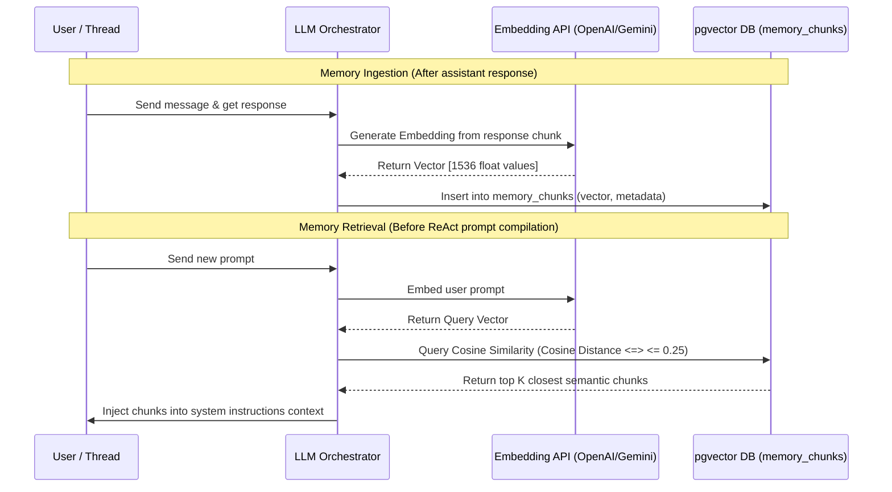

# CLAUDING: pgvector RAG Vector Memory Design

This document details the architectural design for integrating `pgvector` long-term episodic and semantic memory search into CLAUDING agents.

---

## 1. Context & Motivation

Durable agent execution requires two levels of memory:
1. **Short-term memory (Episodic):** Standard thread chat logs (stored in Drizzle `messages` table and retrieved during LLM context assembly).
2. **Long-term memory (Semantic/RAG):** Retaining agent knowledge, documents, and historical events across separate threads. This is done via embeddings stored in the `memory_chunks` table and queried using Cosine Similarity metrics.

---

## 2. Database Schema Configuration

Our PostgreSQL database holds the vector database definition inside Drizzle [schema.ts](file:///d:/Real Kerja/KIRBLE/backend/src/db/schema.ts#L114):

```typescript
export const memoryChunks = pgTable('memory_chunks', {
  id: uuid('id').primaryKey().defaultRandom(),
  ownerId: uuid('owner_id').notNull().references(() => users.id, { onDelete: 'cascade' }),
  agentId: uuid('agent_id').references(() => agents.id, { onDelete: 'cascade' }),
  threadId: uuid('thread_id').references(() => threads.id, { onDelete: 'cascade' }),
  content: text('content').notNull(),
  embedding: vector('embedding', { dimensions: 1536 }).notNull(),
  createdAt: timestamp('created_at', { withTimezone: true }).defaultNow().notNull()
});
```

* **Vector Size:** `1536` dimensions (aligned with OpenAI `text-embedding-3-small` or `text-embedding-ada-002` embeddings).
* **Cascade deletion:** Automatically clean up embeddings if users or agents are deleted.

---

## 3. RAG Storage & Query Flow



---

## 4. SQL Indexing & Performance Optimizations

To scale vector retrieval, an **HNSW (Hierarchical Navigable Small World)** index must be created on the `embedding` column:

```sql
CREATE INDEX IF NOT EXISTS memory_chunks_hnsw_idx 
ON memory_chunks 
USING hnsw (embedding vector_cosine_ops)
WITH (m = 16, ef_construction = 64);
```

### Retrieval Query Example
```sql
SELECT id, content, 1 - (embedding <=> :queryEmbedding) AS similarity
FROM memory_chunks
WHERE agent_id = :agentId
  AND 1 - (embedding <=> :queryEmbedding) > 0.75
ORDER BY embedding <=> :queryEmbedding
LIMIT 5;
```
